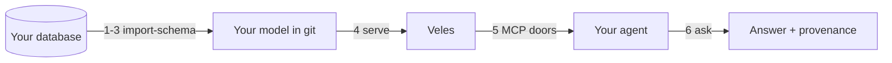

# Quickstart

**A database you already have → a governed answer with its provenance, in under
an hour.** Everything you need is public: the chart, the CLI, and this page.

<!-- TODO(S6): THIS PAGE IS THE ACCEPTANCE RUN'S SCRIPT. The outsider executing
     the RO-3 dry run (SV-P4·S7) works from exactly these seven steps. Every
     command block below is a placeholder until S6 drafts it against the real
     S2 chart on the scratch cluster; every "You should now see…" callout must be
     OBSERVED there, not reasoned about. A step whose verification was never run
     is a step that will fail in front of the outsider. -->

!!! warning "Skeleton — commands not yet verified"

    This page is structure, not instructions. The steps, their order, and their
    verification points are fixed; the commands land in SV-P4·S6, drafted
    against the umbrella chart and run end-to-end on a real cluster first.

## What you will have at the end

An agent answering a question about *your* data, and — the part that matters —
the answer arriving with the record of every rule applied to produce it: the
row-level filters, the masked columns, the caps. Governed, deterministic,
auditable, and visible rather than asserted.



---

## 1. Prereqs

<!-- VERIFY(S6): the kind cluster spec a stranger actually needs — node count,
     memory floor, and whether the bundled dev Keycloak fits inside it. State
     real numbers; "a cluster" is not a prerequisite, it is a shrug. -->

You need:

- A Kubernetes cluster. [kind](https://kind.sigs.k8s.io/) is fine — this whole
  quickstart runs locally.
- A reachable **MSSQL** or **PostgreSQL** database with any schema. Your own is
  the point; a toy one teaches you nothing about your data.
- An OIDC-capable identity provider. The chart bundles a dev Keycloak, which is
  acceptable here and nowhere near production.

```bash
TODO(S6): version-check commands — kubectl, helm, ttr
```

!!! success "You should now see…"

    `TODO(S6)` — each tool reporting a version at or above the floor, and
    `kubectl cluster-info` naming your cluster.

## 2. Install

Install the umbrella chart from GHCR. One chart, the whole roster.

<!-- VERIFY(S6): the OCI ref + the values a first-timer must override (there
     should be almost none — if this step needs a values file, the chart's
     defaults are wrong and that is S2's bug, not this page's). Pin the chart
     version explicitly; `latest` in a quickstart is how a stranger gets a
     different product than the one this page documents. -->

```bash
TODO(S6): helm install from oci://ghcr.io/collite/...
```

!!! success "You should now see…"

    `TODO(S6)` — every pod `Ready`, and `/ready` green on the front door.

## 3. Import your schema

Point `ttr import-schema` at your database. You get back a `db` mirror (a
faithful, deterministic reflection of what is actually there), an `er` first cut
(the importer's *proposal* about how your tables relate), and a **review
checklist** naming every judgement call it made.

The checklist is the point. The importer never silently decides what your data
means — it shows its work, grades its evidence, and asks.

<!-- VERIFY(S6): run this against the hero fixture (the MSSQL schema with
     imperfect FKs + Czech identifiers) — a demo against a clean textbook schema
     proves nothing a stranger cares about, because nobody's real schema is
     clean. Show a REAL checklist with a genuinely uncertain relation in it. -->

```bash
TODO(S6): ttr import-schema --db ... --out ...
```

Walk the checklist in VS Code (the extension links each item to the line it
came from), then commit the model to a git repository. It is yours now.

!!! success "You should now see…"

    `TODO(S6)` — a `db` layer mirroring your tables, an `er` layer proposing
    relations with an evidence grade on each, and a checklist you can actually
    read.

## 4. Serve the model

Point Veles at your model repository.

<!-- VERIFY(S6): the model-repo wiring — is it a values key, a CR, or a URL in
     the UI? Whatever S2 lands, this step says it in one sentence. -->

```bash
TODO(S6): point Veles at the model repo
```

!!! success "You should now see…"

    `TODO(S6)` — the catalog answering: `get_model` via `ttr-meta-mcp` returns
    your model, or the Designer viewer draws it.

## 5. Connect an agent

Register the MCP doors in any MCP client, and forward your user's bearer token
per the identity contract.

That forwarding is not a formality: the platform answers **as your user**, which
is what makes the row filters in step 6 real rather than decorative.

<!-- VERIFY(S6): use a generic MCP-capable assistant as the worked example, not
     our own reference Golem — the bar says a stranger connects THEIR agent. If
     the only thing that connects easily is our agent, we have a product problem
     to find here rather than in front of the outsider. -->

```bash
TODO(S6): MCP client registration + OBO token forwarding
```

!!! success "You should now see…"

    `TODO(S6)` — the client listing the doors, and a whoami-style call coming
    back as your user rather than as a service account.

## 6. Ask

Ask a natural question about your own data.

<!-- VERIFY(S6): THE MONEY SHOT. Step 6 must SHOW the governed path, not claim
     it — a real `pipelineWarnings` payload with an RLS filter, a mask, and a cap
     visible in it. Best possible version: ask the same question as two different
     users and show the provenance differing. That is the thesis on screen, and
     it is what the reader came for. -->

```bash
TODO(S6): the question, through the agent
```

!!! success "You should now see…"

    `TODO(S6)` — your answer, **and** its provenance attachment: the
    `pipelineWarnings` trail naming every row filter, masked column, and cap the
    platform applied on the way out.

    This is the whole thesis, visible: the answer is not a guess about your data,
    it is a governed query over your semantics — and you can read exactly what
    was done to it.

## 7. Where next

You have the promise. Pick the job you actually have:

- **[Model](../model/index.md)** — make the `er` first cut mean what your
  business means. This is where the value compounds.
- **[Connect](../connect/index.md)** — build a real agent: the full MCP surface,
  the identity contract, and the conformance suite as your test harness.
- **[Operate](../operate/index.md)** — run it for real: the values contract,
  your OIDC, policy in git, and one-question-one-trace.
