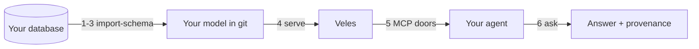

<!-- SPDX-License-Identifier: Apache-2.0 -->
# Quickstart

**A database you already have → a governed answer with its provenance, in under
an hour.** Everything you need is public: the chart, the CLI, and this page.

## What you will have at the end

An agent answering a question about *your* data, and — the part that matters —
the answer arriving with the record of every rule applied to produce it: the
row-level filters, the masked columns, the caps. Governed, deterministic,
auditable, and visible rather than asserted.



!!! note "Where the transcripts on this page come from"

    Every command below was run for real; the outputs are pasted, not
    reconstructed. Steps 1–3 (install and import) run on any cluster with the
    published chart and CLI. Steps 4–6 show real transcripts from a deployed
    Tatrman catalog — your model and data differ, but the *shapes* are exactly
    what you get. The end-to-end governed-execution acceptance run (real result
    rows through a live query worker) is exercised in full at
    [import a database](import-schema.md) and the reference deployment.

---

## 1. Prereqs

You need:

- A Kubernetes cluster. [kind](https://kind.sigs.k8s.io/) is fine — this whole
  quickstart runs locally. A single node with ~4 CPU / 8 GiB is comfortable for
  the light spine below; the bundled dev Keycloak cold-starts in ~2 minutes.
- A reachable **MSSQL** or **PostgreSQL** database with any schema. Your own is
  the point; a toy one teaches you nothing about your data.
- An OIDC-capable identity provider. The chart bundles a dev Keycloak, which is
  acceptable here and nowhere near production.

Check your tools:

```console
$ kubectl version --client
Client Version: v1.34.2
$ helm version --short
v4.2.2+gb05881c
$ kubectl cluster-info
Kubernetes control plane is running at https://<your-cluster>:6443
```

Helm **3.8+** (OCI support on by default) and any recent `kubectl` are the real
floors. Grab the `ttr` CLI (used in step 3) from the release page or build it
from the `ttr-import-schema` module.

!!! success "You should now see…"

    Each tool reporting a version, and `kubectl cluster-info` naming your
    cluster's control plane.

## 2. Install

Install the umbrella chart from GHCR. One chart, the whole roster — pinned to an
explicit version so you get exactly the product this page documents.

```bash
helm upgrade --install ttr \
  oci://ghcr.io/collite/charts/tatrman-server --version 0.9.0 \
  -n ttr --create-namespace \
  --set devIdp.enabled=true
```

The chart is public; the pull resolves without credentials:

```console
$ helm pull oci://ghcr.io/collite/charts/tatrman-server --version 0.9.0
Pulled: ghcr.io/collite/charts/tatrman-server:0.9.0
Digest: sha256:6872f69eb33124795a533983fd3837ec9b59bff4049d0e3a2dc4690bea13b61e
```

`devIdp.enabled=true` brings up a bundled dev Keycloak (realm `tatrman`, a
`demo`/`demo` user) so you can complete the quickstart with no external IdP.
**It is not for production** — wire your own IdP for anything real
(see [Operate → OIDC and Keycloak](../operate/identity-and-oidc.md)).

!!! success "You should now see…"

    The spine coming up — `veles`, `query`, `translate`, `validate`, the
    identity (`whois`) and `health` services, and the dev Keycloak — each pod
    reaching `Ready`, and `/ready` green on the front door. On a capacity-bound
    node, lower the request floor with the documented deploy overlay; the
    workers and MCP doors that need databases and an IdP come up once you wire
    steps 3–5.

## 3. Import your schema

Point `ttr import-schema` at your database. You get back a `db` mirror (a
faithful, deterministic reflection of what is actually there), an `er` first cut
(the importer's *proposal* about how your tables relate), and a **review
checklist** naming every judgement call it made.

The checklist is the point. The importer never silently decides what your data
means — it shows its work, grades its evidence, and asks.

```bash
export DB_PW=…                 # never pass the password on the command line
ttr import-schema \
  --jdbc-url "jdbc:postgresql://your-host:5432/erp" \
  --user analyst --password-env DB_PW \
  --dialect postgresql \
  --package erp \
  --profile czech-erp \
  --out ./erp-model
```

Against a real, imperfect schema — here a seven-table Czech ERP with missing
foreign keys, a code column named `Sleva %` (a space and a percent sign, illegal
as an identifier), and junction tables — the run takes well under a second:

```console
conventions: profile: czech-erp
materialised conventions.yaml from profile: czech-erp
wrote 5 file(s) to ./erp-model
1 identifier(s) mangled (see the review checklist):
  public.Faktura.Sleva % → Sleva_
```

Open `import-review.md`. This is the confidence carrier — the model text stays
clean canonical form, and every judgement lands here graded by evidence:

```markdown
## Relations (evidence grades)

- `Faktura_Ciselnik_StavFaktury` Faktura → Ciselnik_StavFaktury — VERIFIED_FULL (pk-name-match) · FULL · orphans=0
- `Faktura_Odberatel` Faktura → Odberatel — DECLARED (declared:Faktura_IDOdberatel_fkey) · FULL · orphans=0
- `PolozkaFaktury_Faktura` PolozkaFaktury → Faktura — DECLARED (declared:PolozkaFaktury_IDFaktura_fkey) · FULL · orphans=0

## Junctions collapsed (silent M:N)

- public.Artikl_Odberatel — pure M:N junction collapsed into relation Artikl ↔ Odberatel

## Folds PROPOSED (not applied — accept in review)

- PolozkaFaktury/Faktura — possible header/detail fold (PolozkaFaktury is detail of Faktura) — PROPOSED only

## Codebooks proposed (enum-like)

- public.Ciselnik_Stat — codebook table — proposed as an enum-like entity
- public.Ciselnik_StavFaktury — codebook table — proposed as an enum-like entity

## Unmatched columns (look like FKs, resolve to no table)

- public.Artikl(IDKategorie) — looks like a foreign key but resolves to no table — left as a plain attribute

## Renamed identifiers (original ← TTR name)

- `Sleva_` ← `Sleva %` (COLUMN public.Faktura)
```

Note what happened: a relation `Faktura → Ciselnik_StavFaktury` was proposed
**even though the database declared no foreign key for it** — the importer saw
the name and key shapes line up, then *probed the actual rows* (`orphans=0`) and
graded it `VERIFIED_FULL`. It never asserts a relation the data contradicts;
those are held out of the model and listed separately. Walk the checklist in VS
Code (the extension links each item to the line it came from), accept or correct
each call, then commit the model to a git repository. It is yours now.

!!! success "You should now see…"

    A `db` layer mirroring your tables, an `er` layer proposing relations with an
    evidence grade on each, and a checklist you can actually read. See
    [Model → your first three tables](../model/first-three-tables.md) to turn the
    first cut into meaning.

## 4. Serve the model

Point Veles at your model repository — it reads the model from git, so shipping
a new model is a `git push`.

```bash
# Veles reads METADATA_GIT_REMOTE_URI; set it via the chart's values
# (or the model-repo field in the Designer viewer).
helm upgrade ttr oci://ghcr.io/collite/charts/tatrman-server --version 0.9.0 \
  --reuse-values --set veles.metadataGitRemoteUri="https://github.com/you/erp-model.git"
```

The catalog is now answering. Any MCP client can read it through the
`veles-mcp` door; here is the tool surface a real deployment exposes:

```console
$ # tools/list on the veles-mcp door
get_tables            get_table_details
get_entities          get_entity_details
get_relationships     get_pattern_queries
get_model             list_roles           resolve_area
```

Calling `get_entities` returns your logical model — real transcript from a
deployed Czech field-sales catalog:

```json
[
  { "id": "er.entity.faktura",              "name": "faktura" },
  { "id": "er.entity.prodeje",              "name": "prodeje" },
  { "id": "er.entity.návštěva_zákazníka",   "name": "návštěva_zákazníka" },
  { "id": "er.entity.organizační_struktura","name": "organizační_struktura" }
]
```

!!! success "You should now see…"

    The catalog answering: `get_model` / `get_entities` via `veles-mcp` returns
    your model, or the Designer viewer draws it.

## 5. Connect an agent

Register the MCP doors in any MCP client — Claude Desktop and Claude Code both
speak MCP — and **forward your user's identity** per the identity contract.

That forwarding is not a formality: the platform answers **as your user**, which
is what makes the governance in step 6 real rather than decorative. Add the door
to your client (Claude Desktop's `mcpServers`, or `claude mcp add`), pointing at
the door's URL and forwarding an `Authorization: Bearer <token>` from your IdP.

The doors are **fail-closed**. Call one without an identity and it refuses,
naming exactly what it needs — real transcript from the `query` door:

```json
{
  "ok": false,
  "tool": "compile",
  "messages": [
    { "severity": "error", "code": "missing_user_identity",
      "text": "No user identity supplied (Authorization Bearer / X-User-Id / user_id arg)." }
  ],
  "pipelineWarnings": []
}
```

That refusal *is* the contract: no identity, no answer — never a guess about who
is asking. Forward the bearer and the same call proceeds as your user. See
[Connect → identity contract](../connect/identity.md) for what your agent must
forward and the three rejection behaviors.

!!! success "You should now see…"

    Your client listing the doors (`get_model`, `search`, `query`, `compile`),
    and a call that was refused while anonymous now proceeding once you forward
    your token.

## 6. Ask

Ask a natural question about your own data. The platform resolves it against
your model, compiles it to SQL over your real tables, applies your governance,
and returns the answer **with a record of what it did**.

You can watch this without touching a row of data: `compile` runs the whole
translation and governance pipeline and hands back the SQL it *would* execute.
Here a question over the logical entity `prodeje` (Czech: *sales*) compiles to
physical SQL over the real table — real transcript:

```console
$ # compile "SELECT * FROM prodeje" as your user
SELECT "IDSUBJADR"    AS "id_dodacího_místa",
       "IDSKUPZNACZBOZI" AS "id_tržní_skupiny",
       "DTPOSLEDNI_DOD"  AS "poslední_dodávka",
       "HDTRZBA_24M"     AS "tržba_24_měsíců",
       "HDTRZBA_12M"     AS "tržba_12_měsíců"
FROM "XXPRODEJE"
```

The logical model you curated (`prodeje`, `poslední_dodávka`, `tržba_24_měsíců`)
became physical SQL over the actual columns (`XXPRODEJE`, `DTPOSLEDNI_DOD`,
`HDTRZBA_24M`) — the agent never sees, and never needs, the raw column soup.

Run the same query with `query` instead of `compile` and you get the rows **plus
the envelope**: `pipelineWarnings` naming every row-level filter, masked column,
value-label substitution and cap the platform applied on the way out. Compiling
with `apply_security=false` is refused unless you hold the admin role — the
governance is not advisory.

!!! success "You should now see…"

    Your answer, **and** its provenance attachment: the `pipelineWarnings` trail
    naming every row filter, masked column, and cap the platform applied.

    This is the whole thesis, visible: the answer is not a guess about your data,
    it is a governed query over your semantics — and you can read exactly what
    was done to it.

## 7. Where next

You have the promise. Pick the job you actually have:

- **[Model](../model/index.md)** — make the `er` first cut mean what your
  business means. This is where the value compounds.
- **[Connect](../connect/index.md)** — build a real agent: the full MCP surface,
  the identity contract, and the conformance suite as your test harness.
- **[Operate](../operate/index.md)** — run it for real: the values contract,
  your OIDC, policy in git, and one-question-one-trace.
