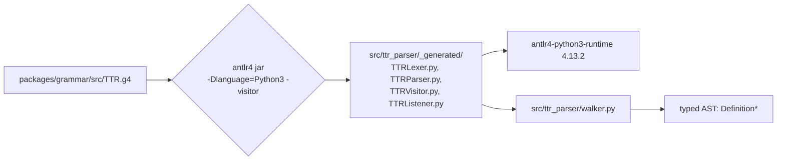
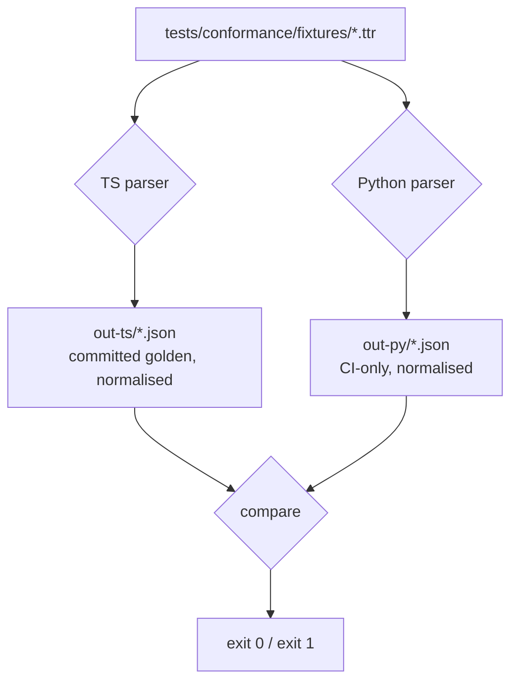

# Architecture — Python parser

**Companion to:** [`INDEX.md`](INDEX.md), [`contracts.md`](contracts.md),
[`plan.md`](plan.md). Mirrors the Kotlin design in
[`docs/grammar-master/architecture.md`](../../grammar-master/architecture.md) —
read that first; this doc describes only what is *different* for the Python
target.

This describes the **target shape** of a `packages/python/ttr-parser/` package
that parses `.ttr` files into a typed Python AST isomorphic to the TS and Kotlin
parsers **and resolves references** the same way. Read-only, model-files-only,
parser + walker + semantics, all in **one** distribution (D8) — see
[`INDEX.md`](INDEX.md) "Scope".

## 1. Problem

Developers building solutions **outside** ai-platform want to consume TTR models
from the central place. Today there are two parsers — TS (in-process for the LSP
and Designer) and Kotlin (published Maven artifacts for the JVM runtime). Neither
serves a Python consumer. The options a Python team has today are: shell out to
the Kotlin CLI, re-implement a parser by hand, or scrape the YAML the platform
emits. All three drift from the canonical grammar.

The clean answer is a **third ANTLR target** plus a **port of the semantics
layer**. Because `TTR.g4` is target-neutral (verified: no `@members`/`@header`,
no embedded `{…}` actions, no semantic predicates), ANTLR's Python3 target
generates a working lexer+parser from the **same** `.g4` with no grammar edits.
The hand-written code is the walker (parse tree → typed AST), the loader, and the
semantics layer (symbol table + six-step resolver + package inference + validator
+ stock vocab) — all ports of the canonical TS modules in
`packages/semantics/src/`, pinned to them by the conformance harness so they
cannot diverge.

## 2. Tech stack

| Layer | Tech | Notes |
|---|---|---|
| Grammar source | ANTLR4 `.g4` (target-neutral) | `packages/grammar/src/TTR.g4`; canonical `@grammar-version: 2.2`. Unchanged. |
| Python parser generation | **Reference ANTLR tool (`antlr4` jar) 4.13.2**, `-Dlanguage=Python3 -visitor` | NEW. Reads the same `.g4` directly, no vendoring. **Not `antlr-ng`** (TS-only). |
| Python parser runtime | `antlr4-python3-runtime==4.13.2` | Pinned to the same ANTLR major.minor as `org.antlr:antlr4-runtime:4.13.2` (Kotlin) so parse behaviour matches. |
| Python version floor | CPython **3.13+** | `match`/structural-pattern dispatch on the AST union, PEP 604 `X | Y` unions, `dataclasses(slots=True)`. (Bumped from 3.10 in P1.1 — matches the project's toolchain.) |
| Packaging | `pyproject.toml` + Hatchling (PEP 517) | Build hook runs the ANTLR generate step; wheel ships the generated parser. |
| Semantics | Port of `packages/semantics/src/` (qname, symbol table, resolver, package inference/graph, validator subset, stock loader) | NEW. Hand-written Python in `ttr_parser.semantics`; pinned to the TS layer by the §5.1 semantics conformance dump. |
| Stock CNC vocab | `cnc-roles.ttr` shipped as package data | Copied from the canonical `packages/semantics/src/stock/cnc-roles.ttr` at build time; loaded via `importlib.resources`. |
| Tests | **pytest** | Mirrors the Kotlin Kotest suites (`TtrLoaderSpec`, `DedentSpec`, `TaggedBlockSpec`, `InlineMappingsSpec`, `DrillMapParserSpec`, `ResolverSpec`, `StockLoaderSpec`). |
| Lint / format | **ruff** (lint+format) + **mypy** (strict) | `_generated/` excluded, same as ktlint excludes `**/generated/**`. |
| Distribution | CI-built wheels → **public PyPI** (D3); tag `python/v<x.y.z>` | Java only in CI; consumers get a pure-Python wheel, no JVM. See §8. |
| Conformance | pytest dumpers → JSON, diffed against the TS golden baselines | NEW `py-dump` (AST) + `py-sem-dump` (resolution) jobs in `conformance.yml`. |

## 3. Repository layout (added to modeler)

```
modeler/
├── packages/
│   ├── grammar/                       ← canonical TTR.g4 (unchanged)
│   ├── parser/                        ← TS parser (antlr-ng)
│   ├── kotlin/ttr-parser/             ← Kotlin parser (ANTLR Gradle plugin)
│   └── python/                        ← NEW
│       └── ttr-parser/
│           ├── pyproject.toml         ← Hatchling; build hook → generate step
│           ├── README.md              ← consumer quickstart
│           ├── scripts/
│           │   └── generate-python-parser.sh   ← antlr4 jar → _generated/
│           ├── src/ttr_parser/
│           │   ├── __init__.py        ← public API re-exports (parse_string, …)
│           │   ├── _generated/        ← GITIGNORED: TTR{Lexer,Parser,Visitor}.py
│           │   ├── model.py           ← Definition/PropertyValue/SourceLocation
│           │   ├── walker.py          ← parse tree → typed AST (port of walker.ts)
│           │   ├── loader.py          ← parse_string / parse_file / parse_directory
│           │   ├── dedent.py          ← triple-string dedent (CPython parity)
│           │   ├── tag_registry.py    ← tagged-block tag → language kind
│           │   ├── diagnostics.py     ← DiagnosticCode enum
│           │   └── semantics/         ← NEW (D8): the resolution layer
│           │       ├── __init__.py    ← Resolver, SymbolTable, … re-exports
│           │       ├── qname.py       ← port of qname.ts
│           │       ├── symbol_table.py        ← port of symbol-table.ts / project-symbols.ts
│           │       ├── package_inference.py   ← port of package-inference.ts
│           │       ├── package_graph.py       ← port of package-graph.ts
│           │       ├── resolver.py    ← six-step chain (port of resolver.ts)
│           │       ├── validator.py   ← portable validator subset (validator.ts)
│           │       ├── stock_loader.py        ← port of stock-loader.ts
│           │       └── stock/cnc-roles.ttr    ← package data, copied from canonical
│           └── tests/
│               ├── test_loader.py     ├── test_dedent.py
│               ├── test_resolver.py   ├── test_stock_loader.py
│               ├── test_tagged_block.py  └── conformance/
│                                          ├── dump.py       ← AST dump (§5)
│                                          ├── dump_sem.py   ← resolution dump (§5.1)
│                                          └── test_conformance.py  ← diff vs out-ts{,-sem}
├── tests/conformance/
│   ├── fixtures/                      ← SHARED (unchanged; single files + multi-doc dirs)
│   ├── out-ts/                        ← TS golden baseline — AST (the reference)
│   ├── out-ts-sem/                    ← TS golden baseline — resolution (the reference)
│   ├── out-py/                        ← NEW: Python AST dumps (gitignored, CI-only)
│   └── out-py-sem/                    ← NEW: Python resolution dumps (gitignored, CI-only)
└── .github/workflows/
    └── conformance.yml               ← UPDATED: + py-dump, py-sem-dump, py-vs-ts diffs
```

**Coexistence rule (extends the Kotlin one):** the pnpm, Gradle, and Python
builds never share artifacts at build time. All three read
`packages/grammar/src/TTR.g4` as input and produce their own generated sources
independently. CI runs them as parallel jobs.

## 4. ANTLR generation flow



- `scripts/generate-python-parser.sh` mirrors
  `packages/grammar/scripts/generate-typescript-parser.sh`: one command,
  output into `_generated/`. It runs the reference `antlr4` jar (downloaded /
  cached, version-pinned 4.13.2), **not** `antlr-ng`.
- The Hatchling build hook runs this step before assembling the wheel, so the
  published wheel contains the generated parser (`_generated/` is in the wheel,
  gitignored in the tree — D4).
- `-visitor` is requested for parity with the Kotlin/TS generation args; the
  walker uses **direct context traversal** (top-down), not the generated
  visitor/listener, matching `TtrWalker.kt` and `walker.ts`. The visitor base
  is generated but unused — harmless.
- ruff/mypy exclude `_generated/**`.

## 5. Walker & loader (the only hand-written logic)

The Python `walker.py` is a structural port of `walker.ts` /
`TtrWalker.kt` — a top-down traversal of the ANTLR parse-tree contexts that
emits typed `Definition` nodes. The pieces that must match byte-for-byte (and
that the conformance harness pins):

| Concern | TS / Kotlin source | Python port note |
|---|---|---|
| 16 `def <kind>` shapes | `ast.ts` / `Definition.kt` | `model.py` frozen dataclasses; one `kind` class-var per subtype. |
| 8 `PropertyValue` variants | `walker.ts` `visitValue` | `walker.py`; `IdValue` carries `parts` (split on `.`). |
| Triple-string **dedent** | `Dedent.kt` / TS dedent | `dedent.py`. **Irony:** the spec *is* "Python `textwrap.dedent` semantics", but the exact rule (drop leading newline after `"""`, longest common prefix over non-blank lines, normalise blank lines to empty) is not 100% `textwrap.dedent` — the leading-newline drop and blank-line normalisation are added on top. Pinned by `test_dedent.py` against the CPython reference cases (same as `DedentSpec`). |
| Tagged blocks (`"""<tag>…"""`) | `tag-registry.ts` / `TagRegistry.kt` | `tag_registry.py`; resolves `tag` → `language`/`dialect`, strips fence, dedents. |
| `Reference` dotted-name split | `walker.ts` | `path`, `parts`, `source`. |
| `SourceLocation` indexing | `makeSourceLocation` | `line`/`endLine` 1-indexed, `column`/`endColumn` 0-indexed, offsets 0-indexed with `offsetEnd` exclusive. **Multi-token span invariant:** `end_column = stop_token.column + len(stop_token.text)` — **not** `start_column + span_length` (the bug `CLAUDE.md` warns about). |
| Error accumulation | custom `BaseErrorListener` | `loader.py`; syntax errors **never raise**, accumulate on `ParseResult.errors`; on any error `definitions == []` (no partial trees). |

`loader.py` mirrors `TtrLoader`: `parse_string` / `parse_file` /
`parse_directory`, the last filtering to `*.ttr`, **excluding** `*.ttrg`, and
skipping `.modeler` / `node_modules` / `.git`.

ANTLR's Python and Java runtimes produce equivalent parse trees from the same
grammar at the same version, so the port is a transcription, not a redesign.

## 5a. Semantics layer (port of `packages/semantics/src/`)

`ttr_parser.semantics` (D8 — same distribution) is a faithful port of the
canonical TS semantics modules. The binding instruction, as on the Kotlin side,
is **"mirror `resolver.ts` exactly"** — the conformance harness (§7) enforces it.

| Concern | TS source | Python module | Note |
|---|---|---|---|
| Qualified names | `qname.ts` | `qname.py` | `Qname` value wrapper; `segments` / `last` / `parent`. |
| Symbol table | `symbol-table.ts`, `project-symbols.ts` | `symbol_table.py` | Project-level table: `upsert_document` / `get` / `get_all` / `get_by_package` / `get_by_suffix` / `duplicates`. `SymbolEntry` carries the full TS shape. |
| Package inference | `package-inference.ts` | `package_inference.py` | `<root>/foo/bar/baz.ttr` → package `foo.bar`; root file → empty package. Advisory only (qnames are declaration-driven). |
| Package graph | `package-graph.ts` | `package_graph.py` | Dependency edges + cycle detection. |
| Resolver | `resolver.ts` | `resolver.py` | **The six-step chain** (below). `ResolutionContext` carries `schema_code` / `namespace` / `enclosing_qname` / `imports` / `package_name`. Result is the `ResolutionResult` union. |
| Validator | `validator.ts` | `validator.py` | The **portable subset** (per §5.1 rule 3): document, references, project, imports. TS-only validators that need structured inputs the `ParseResult` lacks (file-ordering, `.ttrg` graph, package-declaration, duplicate-search-property) are excluded. |
| Stock vocab | `stock-loader.ts` + `stock/cnc-roles.ttr` | `stock_loader.py` + bundled `stock/cnc-roles.ttr` | `load()` parses the bundled vocab; resolved by upserting under a `stock://` URI so `cnc.*` auto-imports work. The vocab is the **canonical** file, copied into the wheel at build (no committed duplicate). |

**Six-step resolution chain** (identical order to `resolver.ts`):

```
lexical → same-package → named-import → wildcard-import (non-recursive,
exactly one extra segment) → cnc.* auto-import → fully-qualified
```

The resolver resolves stock roles to the **doubled** `cnc.cnc.role.<name>` qname
form (the `isStockCnc` shape the symbol table stores stock under) — matching both
the TS and Kotlin layers, and pinned by the §5.1 dump.

**Public entry point.** A convenience that ties parse + resolve together for the
common consumer flow:

```python
proj = ttr_parser.load_project(root)      # parse_directory + symbol table + stock
res  = proj.resolve("fact", context)      # ResolutionResult
```

Exact signatures: [`contracts.md`](contracts.md) §3.

## 6. AST mapping (TS / Kotlin → Python)

Python classes mirror the **Kotlin** names (`ModelDef`, `Er2DbEntityDef`,
`SearchHintsValue`, `LocalizedStringValue`) with **snake_case fields**
(`primary_key`, `value_labels`, `override_auto`). The full three-way table —
TS type ↔ Kotlin type ↔ Python type, and field name ↔ TTR surface name — is
maintained as a **new Python column** in
[`AST-NAMING.md`](../../grammar-master/AST-NAMING.md). Exact Python signatures
live in [`contracts.md`](contracts.md).

The conformance dump (§7) is **naming-agnostic**: its discriminator is the
lowercased TTR keyword (`table`, `er2db_entity`, `drill_map`) and its property
keys are the TTR **surface** names (`primaryKey`, `valueLabels`). So Pythonic
class/field naming never affects the cross-language diff — the dumper maps
snake_case fields → surface names via the rename map.

## 7. Conformance harness (TS golden ⇄ Python)

**Purpose:** the same drift-catch the Kotlin parser gets. The moment the grammar
or any walker adds a property, the Python walker that hasn't kept up fails CI —
instead of failing silently in a downstream Python consumer.



- **Same fixtures, same JSON dump schema, same normalisation rules** as
  grammar-master `contracts.md` §5 (strip `SourceLocation`; sort keys; kind =
  lowercased keyword; property keys = TTR surface name; numbers/bools/null
  native). The Python dumper (`tests/conformance/dump.py`) re-implements those
  rules exactly.
- **Reference = the committed TS goldens** (`tests/conformance/out-ts/` for AST,
  `out-ts-sem/` for resolution). Both Kotlin and Python diff against them, so TS
  is the single source of truth and the three targets are pinned transitively.
  Python diffs `out-py` vs `out-ts` and `out-py-sem` vs `out-ts-sem`.
- **Both dumps apply (D8).** The §5 *parser/AST* dump **and** the §5.1
  *semantics* dump. The semantics dump loads the stock CNC vocab, builds the
  symbol table, resolves every reference and runs the portable validator subset,
  emitting `{ diagnostics, resolved }` that must be byte-identical to the TS
  golden. Multi-document fixture **subdirectories** (same-package / named-import
  / wildcard-import scenarios with a same-named decoy) are loaded into one
  project symbol table before resolving — exactly as the TS/Kotlin harness does.
- **CI:** new `py-dump` (AST) and `py-sem-dump` (resolution) jobs in
  `conformance.yml` (setup-python, install runtime, run generate step, run the
  dumpers) plus `py-vs-ts` diff jobs for both. The workflow already runs on every
  PR; the Python jobs are fast and additive.

## 8. Distribution (resolved: public PyPI)

Python has no native GitHub Packages registry (GitHub Packages hosts
npm/maven/gradle/docker/nuget/rubygems — **not** PyPI), so the Kotlin "publish to
`maven.pkg.github.com`" model doesn't transfer. The user confirmed the TTR
language will be **public**, so (OQ1 resolved):

- **CI-built wheels published to public PyPI** as `ttr-parser`. `pip install
  ttr-parser` gives a **pure-Python wheel** — the generated ANTLR parser and the
  stock `cnc-roles.ttr` are bundled in the wheel, so consumers need **no JVM** and
  no extra steps to get resolution.
- `_generated/` stays **gitignored** (D4); CI runs the ANTLR generate step (Java
  present in CI only) before building the wheel. The repo invariant
  ("generated is regenerated from `TTR.g4`, never committed") is preserved.
- Tag convention: **`python/v<x.y.z>`** triggers `publish-python.yml` (mirrors
  `kotlin/v<x.y.z>`). No SNAPSHOTs (D7); iterate locally with `pip install -e`.
- One distribution carries both parser and semantics (D8), so a single
  `ttr-parser` release version covers the whole consumer surface.

## 9. Out of scope (explicit)

- **Graphs.** No `.ttrg`, no `graph { … }` block, no layout. The consumer needs
  models only; `parse_directory` excludes `.ttrg` (matches Kotlin).
- **Writer.** No model → text renderer. Deferred (`ttr-writer` twin); consumption
  is the stated need (OQ2 resolved — read-only).
- **The TS-only validators.** File-ordering, `.ttrg`-graph, package-declaration
  and duplicate-search-property validators are excluded from the ported validator
  subset (they need structured inputs the `ParseResult` lacks) — same boundary as
  the Kotlin §5.1 dump.
- **Changing the TS or Kotlin parsers.** They are unchanged; Python is purely
  additive. The TS golden remains the conformance reference.
- **A separate `ttr-language` Python repo.** Skipped for the same reason the
  Kotlin work stayed in modeler (grammar-master `plan.md`): one repo owns the
  grammar and all targets.

## 10. Risks

1. **Three targets to keep in sync.** Each grammar change now touches three
   walkers **and three resolvers**. Mitigation: the conformance harness fails the
   PR if the Python walker *or* resolver lags — the same gate that already covers
   Kotlin, now with the §5.1 semantics dump for Python too. Plan for a small
   extra slice of work on grammar-change PRs.
2. **Runtime parse-tree parity.** ANTLR Python vs Java runtimes must produce
   equivalent trees. They do at a pinned shared version (4.13.2); the conformance
   harness is the proof. Mitigation: pin the runtime and the generator to the
   same version as Kotlin; never float.
3. **Dedent / Unicode edge cases.** `SourceLocation` offsets are byte offsets;
   Python strings are Unicode. Mitigation: compute offsets from the same token
   stream ANTLR provides (it already tracks them), and pin against the shared
   fixtures + the CPython dedent reference cases. Note the byte-vs-codepoint
   subtlety explicitly in `walker.py`.
4. **Distribution without GitHub Packages.** Resolved by §8 — CI-built wheels to
   public PyPI; consumers get a pure-Python wheel, no JVM, with the generated
   parser and stock vocab bundled.
5. **Stock vocab drift.** The bundled `cnc-roles.ttr` must stay identical to the
   canonical `packages/semantics/src/stock/cnc-roles.ttr`. Mitigation: copy it at
   build time rather than committing a duplicate (mirrors D4's no-duplicate
   stance for generated code), and the §5.1 resolution dump fails if the stock
   shape diverges (`cnc.*` auto-imports would resolve differently).
6. **`_generated/` not committed (D4).** A consumer doing a source build (sdist)
   would need Java. Mitigation: ship wheels so source builds are never on the
   consumer's critical path; document that contributors need Java + Python.
