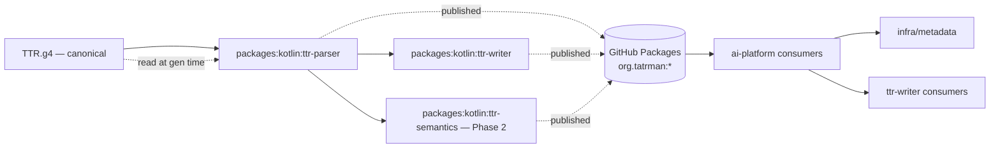
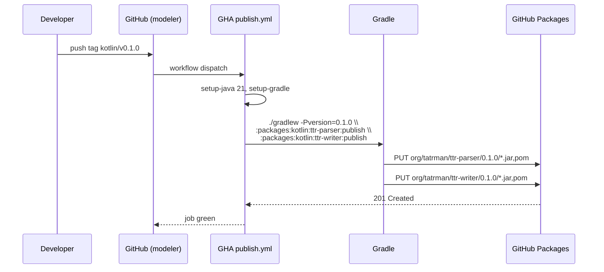
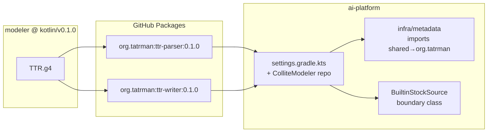
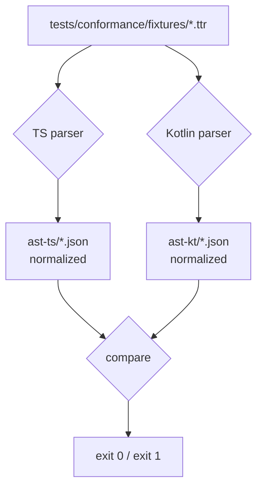
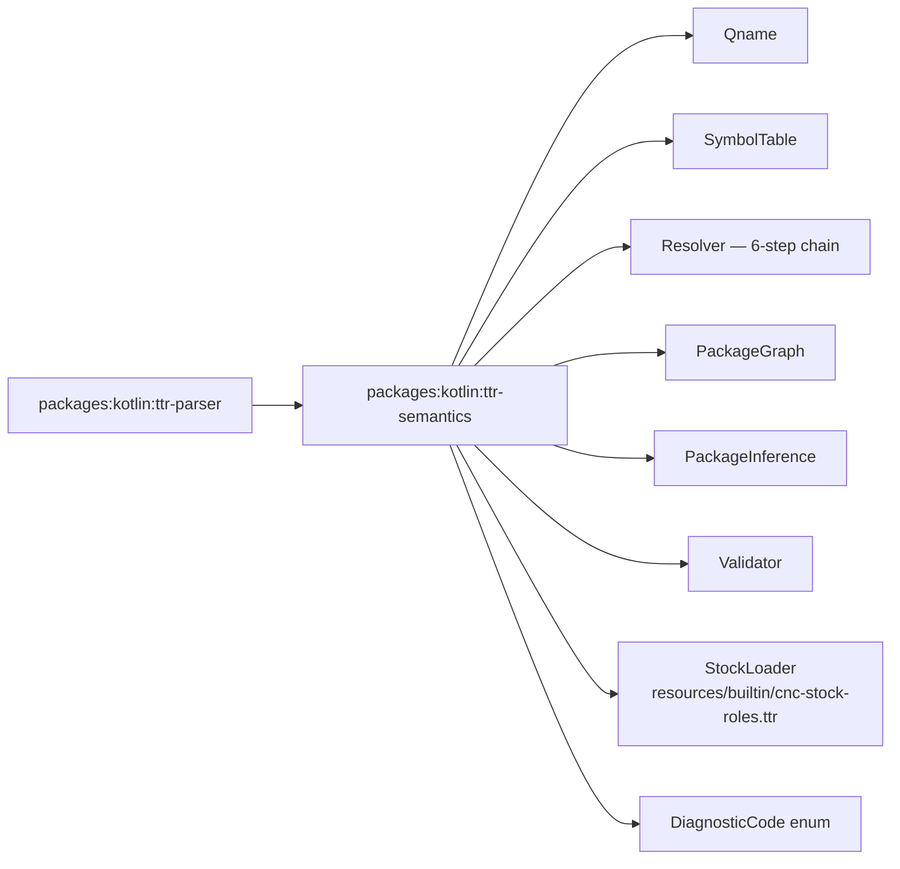

# Grammar-master architecture

**Companion to:** [`plan.md`](plan.md), [`contracts.md`](contracts.md),
[`AST-NAMING.md`](AST-NAMING.md).

This document describes the **target shape** after Phase 1 and Phase 2 land. It
covers module layout, build wiring, the publishing pipeline, ai-platform
consumer flow, and the conformance harness. The current state and the
migration steps live in `plan.md`; the API surfaces live in `contracts.md`.

## Tech stack

| Layer | Tech | Notes |
|---|---|---|
| Grammar source | ANTLR4 `.g4` (target-neutral) | `packages/grammar/src/TTR.g4`; canonical version in `@grammar-version: X.Y` header marker |
| TS parser generation | `antlr-ng` ^1.0.0 (TypeScript target) | Existing pipeline; unchanged |
| TS parser runtime | `antlr4ng` ^3.0.16 | Existing pipeline; unchanged |
| Kotlin parser generation | ANTLR Gradle plugin (built-in, Java target) | NEW in modeler — reads same `.g4` directly, no vendoring |
| Kotlin parser runtime | `org.antlr:antlr4-runtime:4.13.2` | Pinned to match ai-platform's existing version to avoid classpath conflicts |
| Kotlin build | Gradle 9.5 (wrapper-pinned), Kotlin 2.3.0, JVM toolchain 21 | Matches ai-platform's stack |
| Kotlin tests | Kotest 6.1.2 (StringSpec) + Mockk 1.14.9 | Matches ai-platform's stack |
| Lint | ktlint 14.0.1 (Gradle plugin) | Matches ai-platform's stack; generated sources excluded |
| Publishing | `maven-publish` Gradle plugin → GitHub Packages | Same auth model as ai-platform's `cz.dfpartner:*` |
| Conformance harness | Vitest (TS) + Kotest (Kotlin) reading shared JSON fixtures | NEW — runs in CI on grammar / parser changes |

## Repository layout (modeler, post Phase 2)

```
modeler/
├── packages/                          ← TS workspace (pnpm)
│   ├── grammar/                       ← canonical TTR.g4 + version marker
│   ├── parser/                        ← TS parser (antlr-ng generated)
│   ├── semantics/                     ← TS semantics (LSP-side)
│   ├── edit/                          ← TS edit synthesizer
│   ├── lsp/                           ← LSP server (Node + browser worker)
│   ├── vscode-ext/
│   ├── designer/
│   └── kotlin/                        ← NEW: Kotlin Gradle subprojects
│       ├── ttr-parser/                ← Phase 1 — generated parser + walker + model + loader
│       ├── ttr-writer/                ← Phase 1 — TTR renderer (model → text)
│       └── ttr-semantics/             ← Phase 2 — qname, symbol table, resolver, stock vocab, validator
├── tests/
│   ├── integration/                   ← existing TS integration tests
│   └── conformance/                   ← NEW: shared fixtures + TS/Kotlin diff harness
├── settings.gradle.kts                ← NEW: includes the three :packages:kotlin:* subprojects
├── build.gradle.kts                   ← NEW: root build (java-library defaults, publish coords)
├── gradle/
│   ├── wrapper/                       ← NEW
│   └── libs.versions.toml             ← NEW
├── gradlew / gradlew.bat              ← NEW
├── pnpm-workspace.yaml                ← unchanged
└── .github/workflows/
    ├── ci.yml                         ← UPDATED: adds Java setup + Gradle test job
    ├── publish.yml                    ← NEW: publishes Kotlin artifacts on tag
    └── conformance.yml                ← NEW: cross-runtime AST diff
```

**Coexistence rule:** the Gradle build and the pnpm build never share artifacts
at build time. Both read `packages/grammar/src/TTR.g4` as input; both produce
their own generated sources independently. CI runs them as parallel jobs.

## Module wiring (Gradle)



Gradle wiring rules:

- `packages:kotlin:ttr-parser` declares the ANTLR Gradle plugin and points it
  at `../../grammar/src/TTR.g4` via the plugin's `source` property. The
  generated Java parser/lexer lands in `build/generated-src/antlr/main/`.
  Kotlin sources under `src/main/kotlin/org/tatrman/ttr/parser/{model,walker,loader}/`
  consume the generated classes as plain JVM interop.
- `packages:kotlin:ttr-writer` declares
  `api(project(":packages:kotlin:ttr-parser"))` so its consumers transitively
  get the model types.
- `packages:kotlin:ttr-semantics` (Phase 2) declares
  `api(project(":packages:kotlin:ttr-parser"))`.
- No module depends on proto, gRPC, Ktor, Spring, or any ai-platform-specific
  thing. The artifacts are pure Kotlin + ANTLR runtime + SLF4J API.

## ANTLR generation flow

```mermaid
flowchart LR
  G[packages/grammar/src/TTR.g4] --> AT{Gradle ANTLR task}
  AT -- "-visitor -package<br/>org.tatrman.ttr.parser.generated" --> GEN[build/generated-src/antlr/main/<br/>org/tatrman/ttr/parser/generated/<br/>TTR{Lexer,Parser,Listener,BaseListener,Visitor,BaseVisitor}.java]
  GEN --> COMPILE[compileKotlin / compileJava]
  KOTLIN[src/main/kotlin/.../walker/TtrWalker.kt] --> COMPILE
```

- **Output package:** `org.tatrman.ttr.parser.generated` (was
  `shared.ttr.parser.generated` in ai-platform).
- **Plugin args:** `-visitor`, `-long-messages`, `-package
  org.tatrman.ttr.parser.generated`.
- **No source-set folder convention.** Unlike ai-platform's
  `src/main/antlr/shared/ttr/parser/generated/TTR.g4` mirror-path, modeler
  points the ANTLR plugin's `source` files property directly at the canonical
  file. There is no copy step.
- **Generated `.java` files land FLAT** in `build/generated-src/antlr/main/`
  (not nested under the package path) — but they declare
  `package org.tatrman.ttr.parser.generated`, so they compile correctly. Do NOT
  override the ANTLR task's `outputDirectory` to nest them: on a clean rebuild
  ANTLR regenerates flat while the nested copy lingers, causing duplicate-class
  compile errors. The flat layout is cosmetic and harmless.
- **ktlint** excludes `**/generated/**` and any `/generated-src/antlr/` path.

## Publishing pipeline



**Tag conventions** (mirrors ai-platform's `PUBLISHING.md`):

| Tag pattern | Publishes |
|---|---|
| `kotlin/v<x.y.z>` | bundle: `ttr-parser` + `ttr-writer` (Phase 1) — and `ttr-semantics` (Phase 2 onward) |
| `kotlin-parser/v<x.y.z>` | `ttr-parser` only (rare; reserved for parser-only patch) |
| `kotlin-semantics/v<x.y.z>` | `ttr-semantics` only (Phase 2 cadence) |

**No SNAPSHOTs.** Tight iteration uses
`./gradlew publishToMavenLocal -Pversion=0.0.1-LOCAL`; ai-platform points at
`mavenLocal()` for the brief window. Real cross-repo testing uses real
versions.

## ai-platform consumer flow (post Phase 1)



**ai-platform-side changes (Phase 1 P1-5):**

- `settings.gradle.kts` — add `ColliteModeler` Maven repo block alongside
  the existing `AiPlatformPackages` block.
- `gradle/libs.versions.toml` — add `tatrman-ttr-parser = "0.1.0"` +
  `tatrman-ttr-writer = "0.1.0"` version entries and library coordinates.
- Delete `shared/libs/kotlin/ttr-parser/src/main/{antlr,kotlin}/` (vendored
  `.g4` and Kotlin sources).
- Delete `shared/libs/kotlin/ttr-writer/src/main/kotlin/`.
- Either: (a) delete the two empty Gradle modules and update consumers
  (`infra/metadata`, etc.) to depend on the artifact coordinate directly; or
  (b) keep stub `build.gradle.kts` that just `api(libs.tatrman.ttr.parser)` so
  `project(...)` references at consumer sites don't change. Choose during the
  PR; (a) is cleaner.
- Replace imports `shared.ttr.parser.*` → `org.tatrman.ttr.parser.*` across
  ai-platform (mechanical IDE refactor).
- Fix the AST-shape drift surfaced by the migration (top-level `searchable`
  on `ColumnDef`/`AttributeDef` → `search.searchable`). Per
  `ai-platform-upgrade.md` Section B.

## Conformance harness

**Purpose:** catch TS↔Kotlin walker divergence the moment either side adds a
property. Without it, the two walkers slowly drift; the only way today is to
discover the bug in production ai-platform parsing.



**Components:**

- `tests/conformance/fixtures/` — curated `.ttr` files exercising every grammar
  production (one fixture per `def <kind>` plus edge-case fixtures for
  triple-strings, mappings, drill_map, search blocks, packages/imports). Seeded
  by reusing `packages/parser/src/__tests__/` and `samples/` content.
- `tests/conformance/normalize.ts` and `tests/conformance/Normalize.kt` —
  identical normalization rules: strip `SourceLocation`, sort object keys,
  apply the TS↔Kotlin name rename map from
  [`AST-NAMING.md`](AST-NAMING.md) so the comparable shape is naming-agnostic.
- `tests/conformance/run.ts` and `ConformanceSpec.kt` — both produce JSON
  files in a temp dir. A small `diff.ts` script compares pairs; fails the
  build on any drift.
- **CI workflow `conformance.yml`** — runs on every PR touching
  `packages/grammar/`, `packages/parser/`, or `packages/kotlin/ttr-parser/`.
  Job steps: setup Node + setup Java in parallel, run both parsers on the
  fixtures, run the diff. Green = no drift.

**What the harness explicitly does NOT compare:**

- `SourceLocation` fields (different ANTLR runtimes may emit slightly different
  end-column rules — covered by per-side unit tests instead).
- Symbol identifier names (`Er2dbEntityDef` vs `Er2DbEntityDef`) — collapsed
  to a canonical name via the AST-NAMING rename map before diff.
- Diagnostic strings — code+location only, not message text.

## Phase 2 architecture additions



**Resource bundling:** `packages/kotlin/ttr-semantics/src/main/resources/builtin/cnc-stock-roles.ttr`
moves out of ai-platform's `infra/metadata/src/main/resources/builtin/` and
into the published artifact. ai-platform's `BuiltinStockSource` becomes a thin
adapter that calls the published `StockLoader` and wraps the result in
ai-platform's `SourceSnapshot` shape.

**Resolver port:** the Kotlin `Resolver` mirrors `packages/semantics/src/resolver.ts`
exactly — same 6-step chain (lexical → same-package → named imports →
non-recursive wildcard → cnc.* auto-imports → fully-qualified). Public API
matches ai-platform's existing `ReferenceResolver.kt` shape so the consumer
change is a pure import-path swap.

**Conformance extension:** the same harness runs each fixture through both
the TS resolver and the Kotlin resolver, comparing the set of
`(reference, resolvedQname, diagnosticCode)` tuples. Same green/red gate.

## Deferred / out of scope

- The TS parser keeps its current shape. The LSP needs it in-process for both
  Node and browser-worker builds; no shared TS↔Kotlin runtime is attempted.
- Proto-typed APIs (`cz.dfpartner.plan.v1.*`) stay in ai-platform. The
  published Kotlin types are pure data classes.
- IntelliJ plugin work is orthogonal — it will consume the same TS LSP via
  Node, not the Kotlin artifact, so it's unaffected.
- Maven Central / JitPack alternatives evaluated and rejected in `plan.md`;
  GitHub Packages chosen for parity with ai-platform's existing pipeline.
